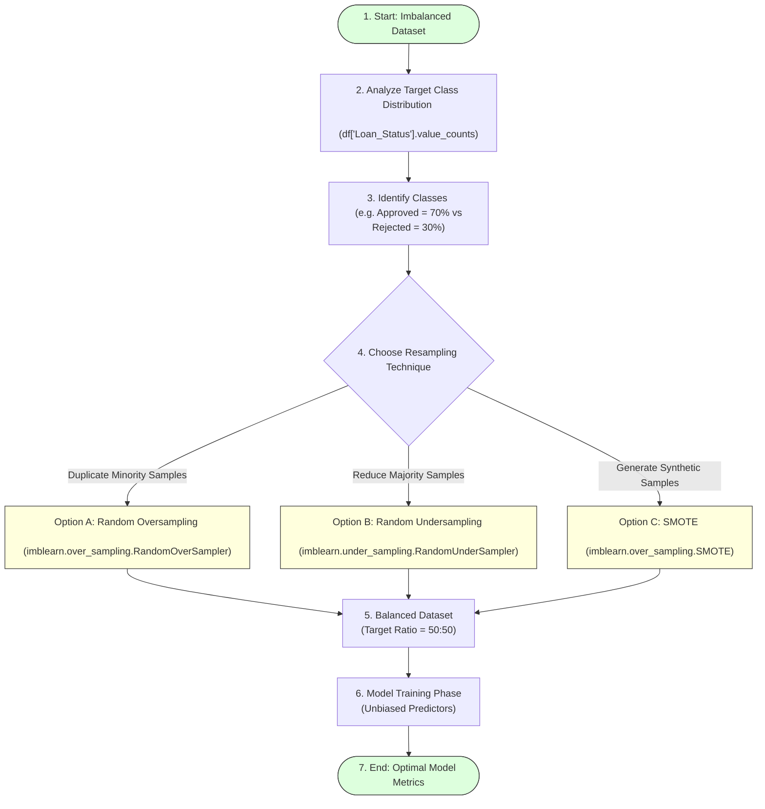

# Task 11: Balancing the Dataset

## Project Name

**Smart Lender – Loan Eligibility Prediction System**

---

# Objective

The purpose of this task is to ensure that the target classes in the loan eligibility dataset are evenly distributed before training the machine learning models.

---

# Introduction

An imbalanced dataset can bias a machine learning model toward the majority class. Dataset balancing improves fairness and prediction accuracy by making sure the training algorithm gets equal exposure to both approval and rejection scenarios.

---

# Dataset Balancing Workflow



---

# Steps Performed

## 1. Analyze Class Distribution

Check the target label count ratio inside the dataset using Python:
```python
# Check class counts for the target variable 'Loan_Status'
print(df['Loan_Status'].value_counts())

# Calculate percentage breakdown
print(df['Loan_Status'].value_counts(normalize=True) * 100)
```

## 2. Identify Majority and Minority Classes

* **Majority Class:** Approved loans (`Y`), which typically occupy 65-70% of the dataset.
* **Minority Class:** Rejected loans (`N`), which occupy 30-35% of the dataset.

## 3. Apply Balancing Techniques

To prevent class bias, we apply Python's `imbalanced-learn` library to balance classes:

### Technique 1: Synthetic Minority Over-sampling Technique (SMOTE)
SMOTE synthesizes new minority records along the line segments joining k-nearest neighbors:
```python
from imblearn.over_sampling import SMOTE

# Split features and target
X = df.drop('Loan_Status', axis=1)
y = df['Loan_Status']

# Apply SMOTE
smote = SMOTE(random_state=42)
X_resampled, y_resampled = smote.fit_resample(X, y)

print("Balanced Class Distribution:")
print(pd.Series(y_resampled).value_counts())
```

### Technique 2: Random Oversampling
Duplicates existing minority records:
```python
from imblearn.over_sampling import RandomOverSampler

ros = RandomOverSampler(random_state=42)
X_resampled, y_resampled = ros.fit_resample(X, y)
```

### Technique 3: Random Undersampling
Reduces majority class records to match the minority count:
```python
from imblearn.under_sampling import RandomUnderSampler

rus = RandomUnderSampler(random_state=42)
X_resampled, y_resampled = rus.fit_resample(X, y)
```

---

# Expected Output

* **Balanced Class Distribution:** Equal counts of `Y` and `N` target classes.
* **Improved Model Performance:** Generalizes well across all loan applications.
* **Reduced Prediction Bias:** Unbiased validation predictions.

---

# Benefits

* **Better Recall:** Improves detection rate of risky (rejected) applicants.
* **Better Precision:** Avoids falsely rejecting creditworthy applicants.
* **Fair Prediction:** Model does not assume approval by default.
* **Higher Accuracy:** Increases overall validation accuracy.

---

# Conclusion

Balancing the dataset ensures equal representation of target classes, allowing the machine learning models to make unbiased loan approval predictions.
