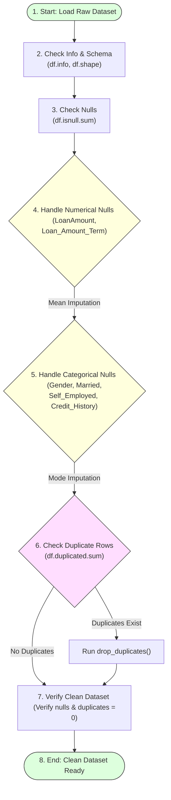

# Task 10: Checking and Handling Values

## Project Name

**Smart Lender – Loan Eligibility Prediction System**

---

# Objective

Data preprocessing is an essential step in machine learning. The objective of this task is to identify and handle missing values, duplicate records, and inconsistent data in the loan eligibility dataset to improve data quality before model training.

---

# Introduction

Real-world datasets often contain incomplete or inconsistent information that can negatively affect the performance of machine learning models. Before training the model, the dataset must be cleaned by identifying missing values, removing duplicates, and correcting inconsistencies.

---

# Data Preprocessing Pipeline Flowchart



---

# Steps Performed

## 1. Import Dataset

Load the loan eligibility dataset using Pandas:
```python
import pandas as pd

# Load dataset
df = pd.read_csv('loan_dataset.csv')
```

## 2. Check Dataset Information

Review the structure of the dataset to identify records counts and column types:
```python
# Display dataset shape, columns, and data types
df.info()
print("Total columns:", df.columns)
print("Total records:", len(df))
```

## 3. Check Missing Values

Analyze columns to count missing value distributions:
```python
# Check count of null values per column
print(df.isnull().sum())
```

## 4. Handle Missing Numerical Values

Replace missing numerical values using the **Mean** method to preserve data distribution:
```python
# Impute numerical columns with mean value
df['LoanAmount'].fillna(df['LoanAmount'].mean(), inplace=True)
df['Loan_Amount_Term'].fillna(df['Loan_Amount_Term'].mean(), inplace=True)
```

## 5. Handle Missing Categorical Values

Replace missing categorical values using the **Mode** (most frequent value) method:
```python
# Impute categorical columns with mode value
df['Gender'].fillna(df['Gender'].mode()[0], inplace=True)
df['Married'].fillna(df['Married'].mode()[0], inplace=True)
df['Self_Employed'].fillna(df['Self_Employed'].mode()[0], inplace=True)
df['Credit_History'].fillna(df['Credit_History'].mode()[0], inplace=True)
```

## 6. Check Duplicate Records

Detect and remove identical records to prevent model overfitting:
```python
# Display number of duplicate rows
print("Duplicate records:", df.duplicated().sum())

# Drop duplicates if present
df.drop_duplicates(inplace=True)
```

## 7. Verify Clean Dataset

Ensure all records are successfully cleaned:
```python
# Verify that null count is now zero across all fields
assert df.isnull().sum().sum() == 0
print("Verification passed! Clean dataset is ready.")
```

---

# Expected Output

* No missing values.
* No duplicate records.
* Clean dataset ready for encoding and scaling.

---

# Benefits

* **Improves Model Accuracy:** Clean features help models find reliable correlations.
* **Reduces Prediction Errors:** Avoids computation anomalies from undefined NaN values.
* **Ensures Consistent Data Quality:** Builds a standardized data profile across all training samples.

---

# Conclusion

After handling missing values and duplicate records, the dataset becomes clean and suitable for machine learning model development.
