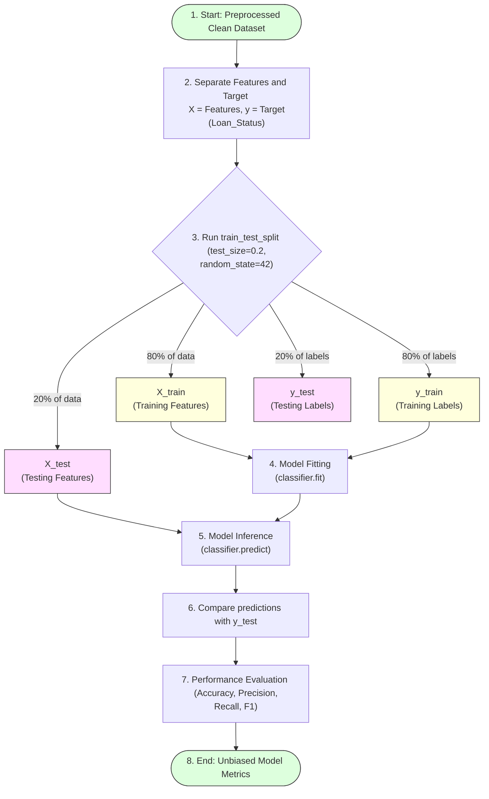

# Task 13: Splitting Data into Training and Test Sets

## Project Name

**Smart Lender – Loan Eligibility Prediction System**

---

# Objective

Split the processed dataset into training and testing sets to evaluate machine learning models effectively.

---

# Introduction

The dataset is divided into two separate matrices:
* **Training Dataset:** Used by models to learn structural rules, coefficient weights, and classification boundaries.
* **Testing Dataset:** Acts as a proxy for unseen "production" data, allowing unbiased performance evaluation of the trained model.

---

# Train-Test Split Workflow



---

# Train-Test Split Configurations

* **Features Matrix (\(X\)):** Contains all predictor variables (e.g. ApplicantIncome, Married, Credit_History, etc.).
* **Target Vector (\(y\)):** Contains the loan eligibility approval target label (`Loan_Status`).
* **Test Size Ratio:** 20% (`test_size=0.2`).
* **Train Size Ratio:** 80%.
* **Random State Seed:** 42 (`random_state=42`). Using a fixed seed ensures that the dataset partition is reproducible across runs.

### Python Code Example:
```python
from sklearn.model_selection import train_test_split

# Separate features (X) and target (y)
X = df.drop('Loan_Status', axis=1)
y = df['Loan_Status']

# Split dataset into 80% train and 20% test subsets
X_train, X_test, y_train, y_test = train_test_split(
    X, 
    y, 
    test_size=0.2, 
    random_state=42, 
    stratify=y  # Stratify preserves class proportions in splits
)

print(f"X_train shape: {X_train.shape}, y_train shape: {y_train.shape}")
print(f"X_test shape: {X_test.shape}, y_test shape: {y_test.shape}")
```

---

# Advantages

* **Prevents Overfitting:** Avoids model memorization of training instances.
* **Evaluates Generalization:** Assesses performance against completely unseen records.
* **Provides Unbiased Model Assessment:** Reports realistic accuracy metric indicators.

---

# Expected Output Matrices

* `X_train` (Training predictor dataframe)
* `X_test` (Testing predictor dataframe)
* `y_train` (Training target labels)
* `y_test` (Testing target labels)

---

# Benefits

* **Reliable Evaluation:** Confirms that prediction performance is stable on out-of-sample data.
* **Better Prediction Accuracy:** Enables validation tuning to prevent modeling bias.
* **Fair Performance Comparison:** Candidates are evaluated against the identical test sets.

---

# Conclusion

Splitting the dataset into training and testing sets is a fundamental step that enables proper evaluation of machine learning models and ensures reliable loan eligibility predictions.
