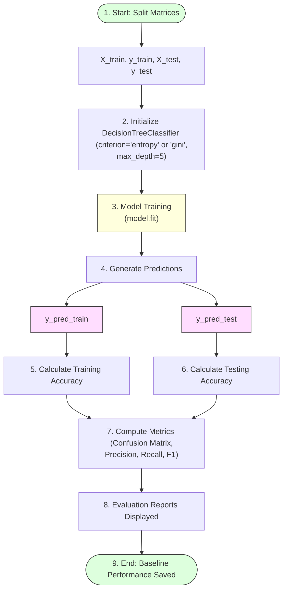

# Task 14: Decision Tree Model

## Project Name

**Smart Lender – Loan Eligibility Prediction System**

---

# Objective

The objective of this task is to build and evaluate a Decision Tree Classifier for predicting loan eligibility based on applicant information.

---

# Introduction

A Decision Tree is a supervised machine learning algorithm used for classification and regression tasks. It predicts outcomes by splitting the dataset into branches based on feature values until a decision is reached.

In this project, the Decision Tree model is trained using the preprocessed loan dataset to classify applicants as either eligible or not eligible for a loan.

---

# Decision Tree Model Lifecycle



---

# Steps Performed

## 1. Import Dependencies
Import classifier class and metrics utilities from Scikit-learn:
```python
from sklearn.tree import DecisionTreeClassifier
from sklearn.metrics import accuracy_score, confusion_matrix, classification_report
```

## 2. Define `decisionTree()` Function
Encapsulate training and validation workflows:
```python
def decisionTree(X_train, X_test, y_train, y_test):
    # Initialize the Decision Tree Classifier
    dt_classifier = DecisionTreeClassifier(
        criterion='entropy', 
        max_depth=5, 
        random_state=42
    )
    
    # Train the model
    dt_classifier.fit(X_train, y_train)
    
    # Predict on training and testing data
    y_pred_train = dt_classifier.predict(X_train)
    y_pred_test = dt_classifier.predict(X_test)
    
    # Calculate accuracy
    train_acc = accuracy_score(y_train, y_pred_train)
    test_acc = accuracy_score(y_test, y_pred_test)
    
    print(f"Training Accuracy: {train_acc:.4f}")
    print(f"Testing Accuracy: {test_acc:.4f}\n")
    
    # Evaluate performance
    print("Confusion Matrix:")
    print(confusion_matrix(y_test, y_pred_test))
    
    print("\nClassification Report:")
    print(classification_report(y_test, y_pred_test))
    
    return dt_classifier
```

---

# Evaluation Metrics Checklist

* **Training Accuracy:** Verifies fit stability against target labels.
* **Testing Accuracy:** Validates prediction generalizability.
* **Confusion Matrix:** Displays true positives, false positives, true negatives, and false negatives.
* **Precision:** Accuracy of positive loan eligibility predictions.
* **Recall:** True positive rate (percentage of actual eligible applicants correctly identified).
* **F1-Score:** Harmonic mean of Precision and Recall.

---

# Expected Output

* **Decision Tree model successfully trained:** Saves classifier metadata rules.
* **Loan eligibility predictions generated:** Outputs classes array (`Approved = 1`, `Rejected = 0`).
* **Model evaluation metrics displayed:** Displays validation report summaries.

---

# Advantages

* **Easy to understand and interpret:** Visualizes rules easily (can be plotted as a visual schema tree).
* **Requires minimal data preparation:** Robust against outliers.
* **Handles both numerical and categorical data:** Automatically splits continuous scales.

---

# Conclusion

The Decision Tree model provides a simple and interpretable baseline for loan eligibility prediction. Its performance is evaluated and compared with other machine learning models in later tasks.
