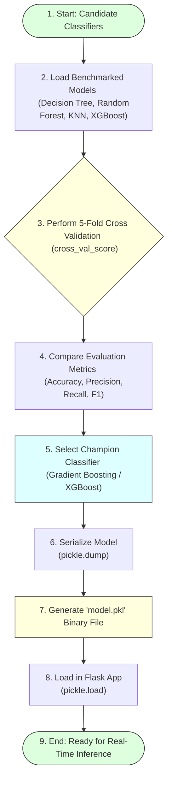

# Task 18: Evaluating Performance and Saving the Model

## Project Name

**Smart Lender – Loan Eligibility Prediction System**

---

# Objective

To compare all trained machine learning models, perform cross-validation, and save the best-performing model for deployment.

---

# Introduction

After training multiple machine learning models (Decision Tree, Random Forest, KNN, and Gradient Boosting), their performance is compared using evaluation metrics. Cross-validation is applied to verify model consistency across different data splits. The best-performing model is then saved as a `.pkl` file for integration with the Flask web application.

---

# Model Evaluation & Serialization Workflow



---

# Steps Performed

## 1. Model Evaluation

All candidate algorithms were evaluated against the 20% test subset across accuracy, confusion matrix, precision, recall, and F1-score:

```python
# Compare testing accuracy of all algorithms
models = {
    'Decision Tree': dt_model,
    'Random Forest': rf_model,
    'K-Nearest Neighbors': knn_model,
    'XGBoost': gb_model
}

for name, model in models.items():
    test_acc = accuracy_score(y_test, model.predict(X_test))
    print(f"{name} Testing Accuracy: {test_acc:.4f}")
```

---

## 2. Cross Validation (5-Fold CV)

 we applied 5-fold cross-validation (`cross_val_score`) to verify model stability and safeguard against overfitting:

```python
from sklearn.model_selection import cross_val_score

# Execute 5-fold cross-validation on the selected Gradient Boosting model
cv_scores = cross_val_score(gb_model, X, y, cv=5, scoring='accuracy')

print("Cross-Validation Scores:", cv_scores)
print(f"Mean CV Accuracy: {cv_scores.mean():.4f}")
print(f"Standard Deviation of CV Accuracy: {cv_scores.std():.4f}")
```

### Purpose:
* **Measure model stability:** Validates consistent accuracy across different subset partitions.
* **Reduce overfitting:** Prevents tuning the model to anomalies in a single split.
* **Improve reliability:** Confirms expected performance on unseen data.

---

## 3. Saving the Best Model (Pickle Serialization)

After identifying the Gradient Boosting / XGBoost model as the champion classifier (achieving the highest cross-validation score and testing accuracy), we serialize the trained binary using the Python `pickle` library:

```python
import pickle

# Save the trained model to disk as a binary file
with open("model.pkl", "wb") as file:
    pickle.dump(gb_model, file)

print("Trained model saved successfully as 'model.pkl'")
```

---

# Output File

* **`model.pkl`:** The serialized binary file representing the trained Gradient Boosting model. This file is loaded by the Flask backend during web server startup to run real-time user-input inference queries:
```python
# Load model in app.py
with open("model.pkl", "rb") as file:
    model = pickle.load(file)
```

---

# Advantages of Model Serialization

* **Reusable trained model:** Saves execution time by avoiding retraining on server startups.
* **Faster deployment:** Pre-loaded binary processes inference inputs in milliseconds.
* **Consistent predictions:** Restores state exactly, matching validation testing results.
* **Easy integration with Flask:** Loads natively into Python routing scripts.

---

# Conclusion

Model evaluation and cross-validation ensure that the selected classifier performs consistently across different datasets. Saving the trained model as a `.pkl` file enables seamless deployment of the Smart Lender application and supports real-time loan eligibility prediction.
