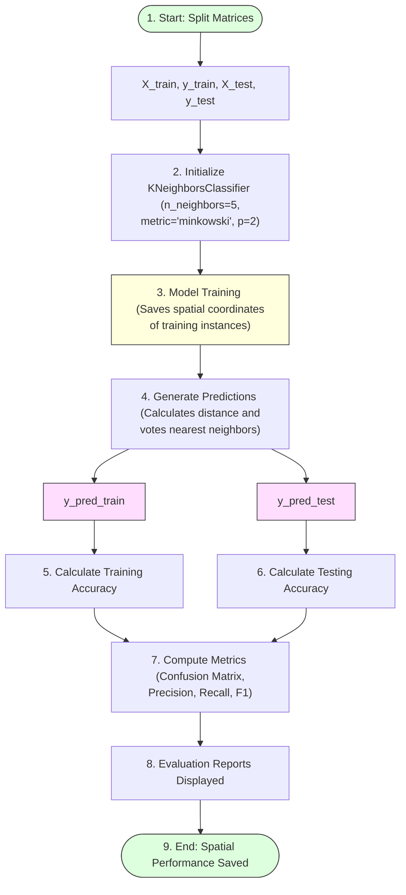

# Task 16: K-Nearest Neighbors (KNN) Model

## Project Name

**Smart Lender – Loan Eligibility Prediction System**

---

# Objective

To implement the K-Nearest Neighbors (KNN) algorithm for loan eligibility prediction and compare its performance with other classification models.

---

# Introduction

K-Nearest Neighbors (KNN) is a non-parametric, instance-based supervised learning algorithm. It classifies a new data point based on the majority class of its nearest neighboring samples within the multi-dimensional feature space, using distance metrics such as Euclidean or Manhattan distance.

In this project, the KNN model is trained and evaluated to serve as a distance-based classification benchmark.

---

# KNN Model Lifecycle



---

# Steps Performed

## 1. Import Dependencies
Import neighbor classifier class and metrics utilities from Scikit-learn:
```python
from sklearn.neighbors import KNeighborsClassifier
from sklearn.metrics import accuracy_score, confusion_matrix, classification_report
```

## 2. Define `KNN()` Function
Encapsulate training and validation workflows:
```python
def KNN(X_train, X_test, y_train, y_test):
    # Initialize the KNN Classifier
    knn_classifier = KNeighborsClassifier(
        n_neighbors=5, 
        metric='minkowski', 
        p=2  # p=2 corresponds to Euclidean distance
    )
    
    # Train the model (stores coordinates in memory)
    knn_classifier.fit(X_train, y_train)
    
    # Predict on training and testing data
    y_pred_train = knn_classifier.predict(X_train)
    y_pred_test = knn_classifier.predict(X_test)
    
    # Calculate accuracy
    train_acc = accuracy_score(y_train, y_pred_train)
    test_acc = accuracy_score(y_test, y_pred_test)
    
    print(f"Training Accuracy: {train_acc:.4f}")
    print(f"Testing Accuracy: {test_acc:.4f}\n")
    
    # Evaluate performance
    print("Confusion Matrix:")
    print(confusion_matrix(y_test, y_pred_test))
    
    print("\nClassification Report:")
    print(classification_report(y_test, y_pred_test))
    
    return knn_classifier
```

---

# Evaluation Metrics Checklist

* **Training Accuracy:** Verifies fit stability against target labels.
* **Testing Accuracy:** Validates prediction generalizability.
* **Confusion Matrix:** Displays true positives, false positives, true negatives, and false negatives.
* **Precision:** Accuracy of positive loan eligibility predictions.
* **Recall:** True positive rate (percentage of actual eligible applicants correctly identified).
* **F1-Score:** Harmonic mean of Precision and Recall.

---

# Expected Output

* **Trained KNN model:** Saves spatial indexing of instances in memory.
* **Loan eligibility predictions generated:** Outputs classes array (`Approved = 1`, `Rejected = 0`).
* **Performance comparison with other algorithms:** Provides a comparison of distance metrics.

---

# Advantages

* **Simple and easy to implement:** Lazy learner with zero training time.
* **Effective for small datasets:** Performs well when instances are clean.
* **No assumptions about data distribution:** Non-parametric technique.

---

# Conclusion

The KNN model classifies loan applicants based on similarity to existing applicants and provides an additional benchmark for evaluating model performance.
