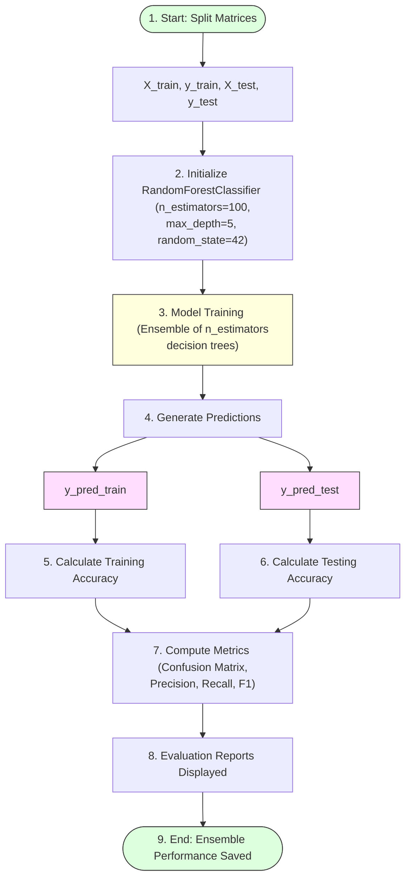

# Task 15: Random Forest Model

## Project Name

**Smart Lender – Loan Eligibility Prediction System**

---

# Objective

To implement the Random Forest Classifier and improve prediction accuracy by combining multiple decision trees.

---

# Introduction

Random Forest is an ensemble learning algorithm that constructs multiple decision trees during training and combines their outputs (using majority voting for classification) to produce a more accurate and stable prediction.

In this project, the Random Forest model is trained to classify loan applications, offering a highly robust ensemble benchmark.

---

# Random Forest Model Lifecycle



---

# Steps Performed

## 1. Import Dependencies
Import ensemble classifier class and metrics utilities from Scikit-learn:
```python
from sklearn.ensemble import RandomForestClassifier
from sklearn.metrics import accuracy_score, confusion_matrix, classification_report
```

## 2. Define `randomForest()` Function
Encapsulate training and validation workflows:
```python
def randomForest(X_train, X_test, y_train, y_test):
    # Initialize the Random Forest Classifier
    rf_classifier = RandomForestClassifier(
        n_estimators=100, 
        criterion='entropy', 
        max_depth=5, 
        random_state=42
    )
    
    # Train the model
    rf_classifier.fit(X_train, y_train)
    
    # Predict on training and testing data
    y_pred_train = rf_classifier.predict(X_train)
    y_pred_test = rf_classifier.predict(X_test)
    
    # Calculate accuracy
    train_acc = accuracy_score(y_train, y_pred_train)
    test_acc = accuracy_score(y_test, y_pred_test)
    
    print(f"Training Accuracy: {train_acc:.4f}")
    print(f"Testing Accuracy: {test_acc:.4f}\n")
    
    # Evaluate performance
    print("Confusion Matrix:")
    print(confusion_matrix(y_test, y_pred_test))
    
    print("\nClassification Report:")
    print(classification_report(y_test, y_pred_test))
    
    return rf_classifier
```

---

# Evaluation Metrics Checklist

* **Training Accuracy:** Verifies fit stability against target labels.
* **Testing Accuracy:** Validates prediction generalizability.
* **Confusion Matrix:** Displays true positives, false positives, true negatives, and false negatives.
* **Precision:** Accuracy of positive loan eligibility predictions.
* **Recall:** True positive rate (percentage of actual eligible applicants correctly identified).
* **F1-Score:** Harmonic mean of Precision and Recall.

---

# Expected Output

* **Trained Random Forest model:** Saves classifier forest metadata rules.
* **Improved prediction accuracy compared to Decision Tree:** Usually shows lower variance.
* **Performance evaluation displayed:** Displays validation report summaries.

---

# Advantages

* **High prediction accuracy:** Combines many weak predictors (decision trees) into a strong model.
* **Reduces overfitting:** Bootstrap aggregation (bagging) mitigates individual tree overfitting.
* **Handles large datasets efficiently:** Works well with many high-dimensional columns.

---

# Conclusion

The Random Forest model improves prediction performance by combining multiple decision trees, making it more robust and reliable for loan eligibility prediction.
