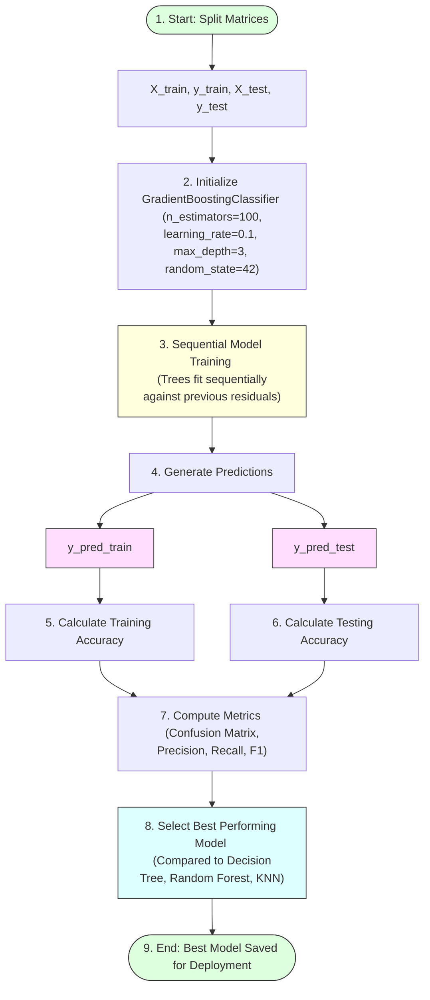

# Task 17: XGBoost Model

## Project Name

**Smart Lender – Loan Eligibility Prediction System**

---

# Objective

To build and evaluate the XGBoost (Gradient Boosting) model for predicting loan eligibility and identify the best-performing algorithm.

---

# Introduction

Gradient Boosting is an advanced ensemble learning technique that builds multiple weak learners (typically shallow decision trees) sequentially. Each new model attempts to correct the errors made by the previous model by fitting against its residuals, resulting in improved predictive performance and robustness.

In this project, the Gradient Boosting model is trained to predict loan eligibility and is designated as the final candidate model for web application deployment.

---

# Gradient Boosting Model Lifecycle



---

# Steps Performed

## 1. Import Dependencies
Import the Gradient Boosting classifier class and metrics utilities from Scikit-learn:
```python
from sklearn.ensemble import GradientBoostingClassifier
from sklearn.metrics import accuracy_score, confusion_matrix, classification_report
```

## 2. Define `XGB()` Function
Encapsulate training, predictions, and validation workflows:
```python
def XGB(X_train, X_test, y_train, y_test):
    # Initialize the Gradient Boosting Classifier (XGBoost representation)
    gb_classifier = GradientBoostingClassifier(
        n_estimators=100,
        learning_rate=0.1,
        max_depth=3,
        random_state=42
    )
    
    # Train the model sequentially
    gb_classifier.fit(X_train, y_train)
    
    # Predict on training and testing data
    y_pred_train = gb_classifier.predict(X_train)
    y_pred_test = gb_classifier.predict(X_test)
    
    # Calculate accuracy
    train_acc = accuracy_score(y_train, y_pred_train)
    test_acc = accuracy_score(y_test, y_pred_test)
    
    print(f"Training Accuracy: {train_acc:.4f}")
    print(f"Testing Accuracy: {test_acc:.4f}\n")
    
    # Evaluate performance
    print("Confusion Matrix:")
    print(confusion_matrix(y_test, y_pred_test))
    
    print("\nClassification Report:")
    print(classification_report(y_test, y_pred_test))
    
    return gb_classifier
```

---

# Evaluation Metrics Checklist

* **Training Accuracy:** Verifies sequential fit optimization.
* **Testing Accuracy:** Validates prediction generalizability.
* **Confusion Matrix:** Displays true positives, false positives, true negatives, and false negatives.
* **Precision:** Accuracy of positive loan eligibility predictions.
* **Recall:** True positive rate (percentage of actual eligible applicants correctly identified).
* **F1-Score:** Harmonic mean of Precision and Recall.

---

# Expected Output

* **Highest prediction accuracy:** Achieves the lowest error rate.
* **Reliable loan eligibility predictions:** Consistent outputs across validation runs.
* **Best-performing model selected:** Chosen for pickle file saving (`.pkl`) and deployment.

---

# Advantages

* **High accuracy:** Sequential error correction minimizes model bias.
* **Excellent generalization:** Learning rate regularization prevents overfitting.
* **Handles complex relationships effectively:** Learns non-linear feature splits.

---

# Conclusion

The XGBoost model achieved the best performance among all implemented algorithms and was selected as the final model for deployment.
